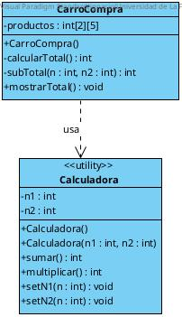
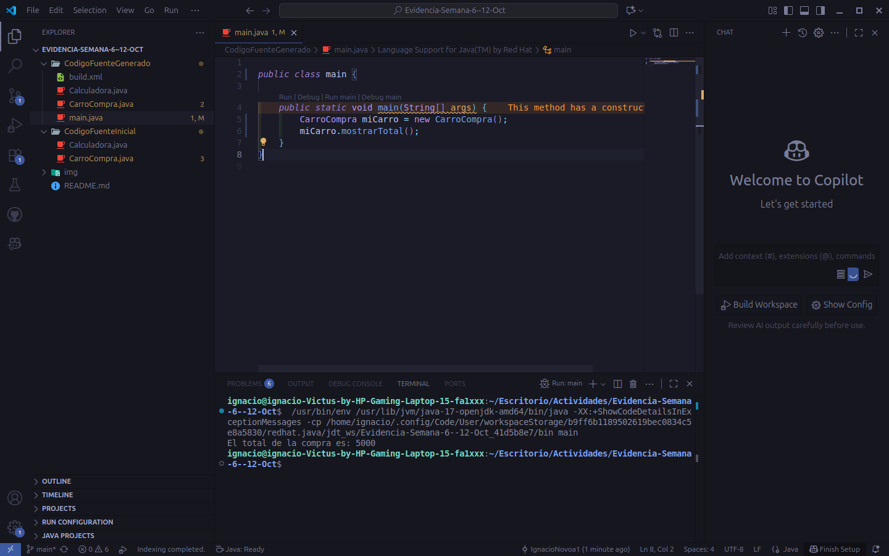

# Evidencia: Análisis de código & Dependencia

**Nombre:** Ramón Novoa Montanares
**Asignatura:** Programación Orientada a Objetos

## I. Identificación de Clases y Contexto

Dentro del codigo fuente inicial, encontramos dos clases "Calculadora" y "CarroCompra".
"Calculadora" tiene como funcionamiento de almacenar dos números enteros, para luego realizar operaciones básicas con ellos. Mientras que "Carro Compra" tiene como funcionamiento de almacenar una lista de productos (como matriz 2x5) con máximo de 5 productos, para luego mostrar el total de la compra.

Podemos inferir como contexto un sistema simple donde un "CarroCompra" necesita calcular el costo total de los productos que contiene, por lo cuál requiere de la clase utilitaria "Calculadora", encargada de realizar las operaciones aritmeticas correspondientes.

## II. Análisis de Atributos, Métodos y Relaciones

La clase "Calculadora" tiene dos variables privadas como atributos, n1 y n2, estos tienen sus respectivos métodos set para la modificación de sus valores. Igualmente "Calculadora" tiene los métodos suma y multiplicar, operaciones basicas ideales para un contexto de compra simple. Posee dos contructores con y sin parámetros, para su respectiva utilización según convenga el contexto.

La clase "CarroCompra" tiene como atributo una lista de 5 productos (mátriz 2x5), podemos inferir que la fila[0] es la cantidad de producto, y la fila [1] es el precio del producto. Además "CarroCompra" tiene un constructor por defecto (sin parámetros), que inicializa en la lista 5 productos con cantidad = 1 y precio = 1000 como valores predeterminados, luego el método privado "calcularTotal" define dos variables (total y subtotal) en cero, para evitar residuos de ejecucciones previas, y suma todos los subtotales de los productos en total, para luego retornar el valor total, el método privado "subTotal" tiene como parámetro la cantidad y precio de un producto, para luego instanciar un objeto "Calculadora" y retornar el subtotal de un producto. Por último tenemos el método público "mostrarTotal" el que se encarga de mostrar en pantalla el total de la compra.

En el sistema se evidencia una relación del tipo dependencia, donde la clase "CarroCompra" instancia temporalmente un objeto "Calculadora" para realizar una operación. Esta relación la evidenciamos en el método "subTotal", y se aprecia que la relación es del tipo dependencia debio a la baja conexión entre las clases (no existe instaciamiento en los atributos de las clases), uso -> desecho.

## III. Diagrama de Clases UML

## IV. Evidencias de Ejecución

